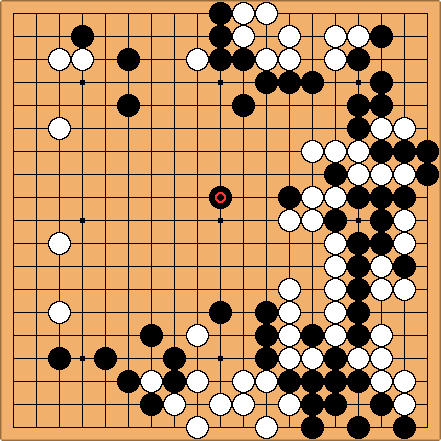

# Go game board recognition :black_circle: :white_circle:
This is a repo that can recognize a continuous frames from video and generate the board state into PDF files in ascending.


<p align="center">
  
</p>


## Run
```
python main.py
```

## TODO list :heavy_check_mark: 
Idx | Content | State | Note
:------------ | :-------------| :-------------| :-------------
1 | Split video into frames | :heavy_check_mark: | 
2 | Recognize frames and generate board, black point and white point | :heavy_check_mark: | only detect pieces, make a version with predict pieces condition
3 | Select valid frames and remove duplicate, occlusion frames | | 
4 | Draw output frame with specific input and output | :heavy_check_mark: |
5 | Generate PDF file |  |
## LOG
### 11/25
- Calculate corner pixel and corresponding R,G,B values
---

### 11/26
- Achieved perspective homography transformation
- GO board line detection
- TODO: calibration on parameters to obtain a precise detection results
---

### 12/10
- recognize black and white point
- some defect error
---

### 12/25
- use CNN model to generate board coordinates and pieces existence
- [TOFIX] our model can only detect pieces existence, add labels to show each position condition probability
- generate board graph with pieces numbers
- extract board images in PDF format
---

### 02/19
  
  Accomplished
  - use conventional CV to remove light reflection effect
  - successful detect all pieces with correct outputs
  - generate board with pieces numbers and states    
---

### 02/28

  Accomplished
  - Make a function to handle input array of board state, and draw circles in an standard form
  
  Future Works:
  - Consider multiple frames inputs, and update the current board state. (Rewrite function)
  - Solve the hand occlusion problem by checking the saved global board to detect whether have any missing pieces 
  - Consider the eaten pieces case

## References
1. [Kifu Snap](https://www.crazy-sensei.com/?lang=en)
2. [Pix Spy](https://pixspy.com/)
3. https://blog.csdn.net/xufive/article/details/112308533
4. https://tw511.com/a/01/36832.html
5. https://auzhu.com/sports/1025003.html
