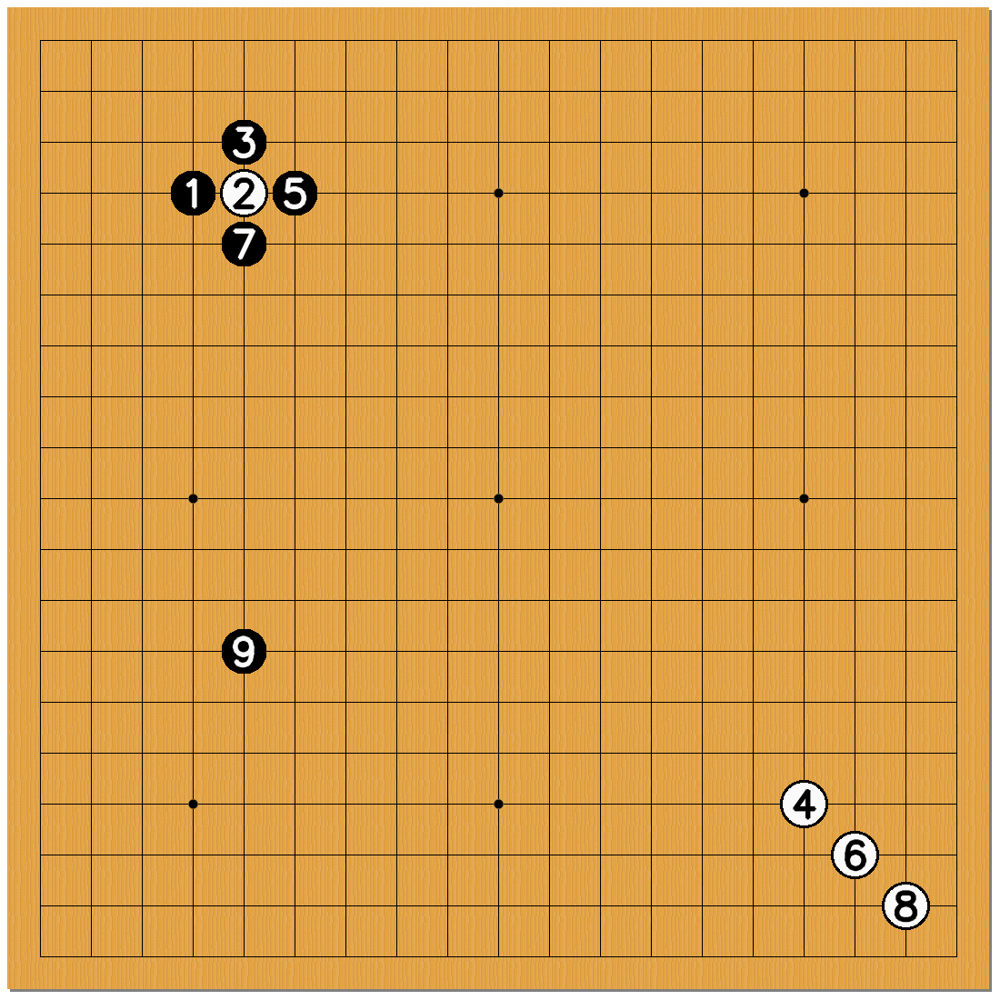

# Go game board recognition :black_circle: :white_circle:
This is a repo that can recognize a continuous frames from video and generate the board state into PDF files in ascending.


<p align="center">
  
</p>


## How to Run
```
python extract_frames.py
python hand_occlusion_CLIP.py
python main.py
read_pic.ipynb
```


## TODO list :heavy_check_mark: 
Idx | Content | State | Note
:------------ | :-------------| :-------------| :-------------
1 | Split video into frames | :heavy_check_mark: | 
2 | Recognize frames and generate board, black point and white point | :heavy_check_mark: | only detect pieces, make a version with predict pieces condition
3 | Select valid frames and remove duplicate, occlusion frames |:heavy_check_mark: |
4 | Draw output frame with specific input and output | :heavy_check_mark: |
5 | Generate PDF file | :heavy_check_mark: |
## LOG
### 11/25
- Calculate corner pixel and corresponding R,G,B values
---

### 11/26
- Achieved perspective homography transformation
- GO board line detection
- TODO: calibration on parameters to obtain a precise detection results
---

### 12/10
- recognize black and white point
- some defect error
---

### 12/25
- use CNN model to generate board coordinates and pieces existence
- [TOFIX] our model can only detect pieces existence, add labels to show each position condition probability
- generate board graph with pieces numbers
- extract board images in PDF format
---

### 02/19
  
  Accomplished
  - use conventional CV to remove light reflection effect
  - successful detect all pieces with correct outputs
  - generate board with pieces numbers and states    
---

### 02/28

  Accomplished
  - Make a function to handle input array of board state, and draw circles in an standard form

---
### 03/04
Accomplished
  - Consider multiple frames inputs, and update the current board state. (Rewrite function)
  - Ensure pieces algo is accurate without hand cases.
  
  Future Works:  
  - Solve the hand occlusion problem by checking the saved global board to detect whether have any missing pieces 
  - Consider the eaten pieces case and label
  - Output into PDF format
    
  TODO and Discussions:
  - Remove hand case by checking pixel RGB values and remove hand frames (Ho)
  - Remove redundant frames by adding delay into videocaptured (Zac)  
  - Output board and string information into PDF (Zac)
  
---
### 03/26
Accomplished
  - Remove redundant frames by adding delay into videocaptured (Zac)  
  - Output board and string information into PDF (Zac)
  
  Future Works:  
  - Solve the hand occlusion problem by checking the saved global board to detect whether have any missing pieces 
  - Consider the eaten pieces case and label
    
  TODO and Discussions:
  - Remove hand case by checking pixel RGB values and remove hand frames
  
---
### 04/02
Accomplished    
  - Consider the eaten pieces case and label
  
  Future Works:  
  - Solve the hand occlusion problem by checking the saved global board to detect whether have any missing pieces 
  - My dict need to store peices color and counter number, build a global board to store the pieces coming time.
    
---
### 04/09
Accomplished    
  - Fix global array with eaten pieces case.
  
  Future Works:  
  - PDF write eaten pieces statement
  - Solve the hand occlusion problem by checking the saved global board to detect whether have any missing pieces 

---
### 04/16
Accomplished    
  - PDF write eaten pieces statement
  
  Future Works:  
  - Reunion all the components
  - Solve the hand occlusion problem by checking the saved global board to detect whether have any missing pieces 

### 05/28
  - Rearrange code

---
### 06/23
Accomplished    
  - Add CLIP to detect hand occlusion
  - Select the first frame from each bundle as prediction results

Discussion
  - How to decide bundle results: (i) Max of W&B pieces combination bundle (ii) Min of pieces count in bundle (iii) First frame of bundle

---
### 07/09
Accomplished    
  - Draw pieces
  - Convert read_pic.ipynb into read_pic.py to import global variables into draw_test.py

Available Fonts
  - [Fonts package names](https://github.com/PyFPDF/fpdf2/tree/master/test/fonts)
  - [Standard Fonts](https://github.com/PyFPDF/fpdf2/blob/d184acf862f0bf90025c5bf8103f5b436fc41b52/fpdf/fonts.py#L217C7-L217C7)
  - [How to import add new Fonts type and use it](https://github.com/PyFPDF/fpdf2/issues/21#issuecomment-757987071)

---
### 07/16
Accomplished    
  - Draw the status of the eaten piece in a PDF file.    

Future Works
  - Bug: For other video input (GO2.mp4), find some way to solve fixed warp perspective coordinates. (This error may cause perspective bias and make piece detection fail.)

## References
1. [Kifu Snap](https://www.crazy-sensei.com/?lang=en)
2. [Pix Spy](https://pixspy.com/)
3. [PDF Generate](https://github.com/PyFPDF/fpdf2)
4. [PDF Generate Document](https://pyfpdf.github.io/fpdf2/Shapes.html)
6. https://tw511.com/a/01/36832.html
7. https://auzhu.com/sports/1025003.html

